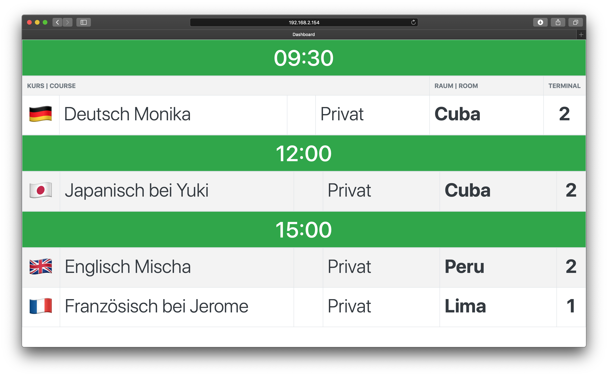

# Automatic monitoring of room distributions
A voluntary project for the [Sprachschule Aktiv language school](https://www.sprachschule-aktiv-muenchen.de/) helping students to find the rooms in which their courses take place.

By building this simple web-app using Node.js and Express, automatic fetching and displaying of data without any need for manual interaction can be achieved.

## Raspberry Pi Setup

### 1. Install Node.js
A Raspberry Pi Zero W will be used. Unfortunately, the processor type **armv6l** is not supported by Node anymore.
However, the newest version which was supported is **11.9.0** and can be installed following these steps:
1. `curl -o node-v11.9.0-linux-armv6l.tar.gz https://nodejs.org/dist/v11.9.0/node-v11.9.0-linux-armv6l.tar.gz`
2. `tar -xzf node-v11.9.0-linux-armv6l.tar.gz`
3. `sudo cp -r node-v11.9.0-linux-armv6l/* /usr/local/`
4. To check if the installation succeded run `node -v` and `npm -v`.

### 2. Clone the repo
Make sure git is installed on the pi. Otherwise, run `sudo apt install git`.

Then, clone the repository and install the node dependencies:
1. `git clone https://github.com/thomasbohm/rooms.git`
2. `cd rooms`
3. `npm i`

### 3. Automatically start server & a browser window
1. `sudo apt install midori matchbox x11-server-utils xinit unclutter`
2. `sudo nano /etc/rc.local`. 
3. Add this line before `exit 0`:
    
    `(/bin/sleep 20 && xinit /home/pi/rooms/autostart.sh) &`